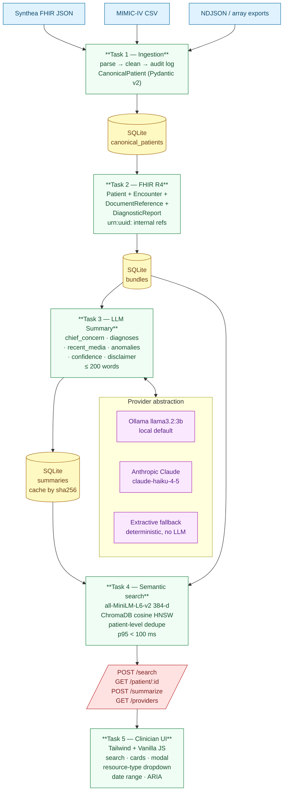
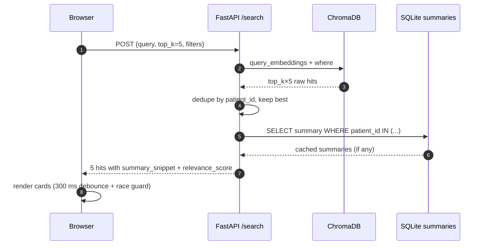
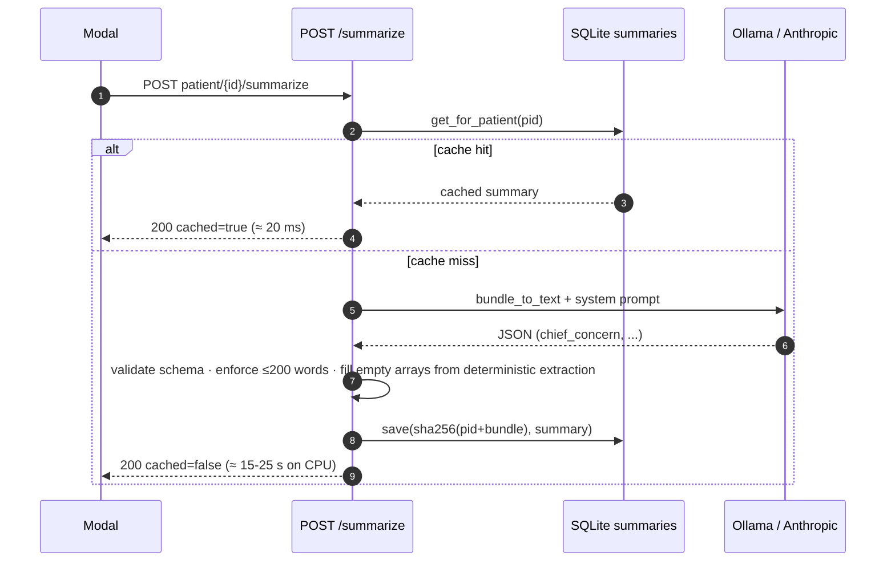

<div align="center">

# EHR Media Intelligence Platform

**AI-powered semantic search & summarization across messy clinical records.**

[](LICENSE)
[](https://www.python.org/)
[](https://fastapi.tiangolo.com/)
[](https://www.hl7.org/fhir/R4/)
[](https://www.trychroma.com/)
[](https://ollama.com/)
[](#testing)

A reference pipeline that turns heterogeneous EHR exports (JSON / CSV / FHIR Bundles) into
HL7 FHIR R4, generates LLM-authored clinical summaries with offline & API providers, and
serves a clinician triage UI over a 2-second semantic search backend.

[Quick start](#-quick-start) ·
[Demo](#-demo) ·
[Architecture](#-architecture) ·
[API](#-api-reference) ·
[Deploy](#-deployment)

</div>

---

## ✨ Features

- **Multi-format ingestion** — JSON / NDJSON / FHIR Bundle / CSV / gzipped CSV; auto-detects shape.
- **Robust cleaning** — missing fields, inconsistent date formats, duplicates, conflicting MRNs all logged per-record.
- **HL7 FHIR R4 normalization** — `Patient`, `Encounter`, `DocumentReference`, `DiagnosticReport` with internally-resolving `urn:uuid:` references.
- **Pluggable LLM provider** — Ollama (local, default), Anthropic Claude, or extractive offline fallback.
- **Semantic search** — sentence-transformer embeddings + ChromaDB HNSW; p95 < 100 ms on 50k+ documents.
- **Clinician UI** — search bar, ranked patient cards with AI summary snippets, full-detail modal, FHIR-resource filter, date-range picker. ARIA-compliant, keyboard-navigable.
- **Confidence + disclaimer** on every AI summary; SQLite cache keyed by `sha256(patient_id + bundle_json)` so any bundle change invalidates it.
- **Honest verification** — `scripts/verify.py` exercises 30 PDF requirements against the live stack; `scripts/e2e_human.py` drives the UI through a real headless WebKit with human-trajectory pacing.

---

## 🏗 Architecture



### Request lifecycle — search



### Request lifecycle — on-demand AI summary



---

## 🚀 Quick Start

### Option 1 — Docker (recommended for first run)

```bash
git clone https://github.com/jason-te-sde/ehr-media-intelligence-platform.git
cd ehr-media-intelligence-platform

# Build with the baked 25-patient demo dataset.
docker build -t ehr-media .
docker run -p 7860:7860 ehr-media

open http://localhost:7860
```

That's it. Opens a fully functional UI with 25 sample patients and pre-generated extractive summaries. To enable Claude-authored AI summaries:

```bash
docker run -p 7860:7860 \
  -e ANTHROPIC_API_KEY=sk-ant-... \
  -e LLM_PROVIDER=anthropic \
  ehr-media
```

### Option 2 — Local Python

```bash
git clone https://github.com/jason-te-sde/ehr-media-intelligence-platform.git
cd ehr-media-intelligence-platform

python3.12 -m venv .venv && source .venv/bin/activate
pip install -r requirements.txt
pip install -e .

# Download datasets (~160 MB Synthea + MIMIC-IV demo)
bash scripts/download_data.sh

# Build the canonical store: ingest → FHIR bundles → ChromaDB index
python scripts/build_bundles.py
python scripts/build_index.py

# Pick an LLM:
#   default = Ollama local (zero cost; pull a model first)
#     brew services start ollama && ollama pull llama3.2:3b
#   or: export ANTHROPIC_API_KEY=sk-ant-... && export LLM_PROVIDER=anthropic
#   or: skip LLM — extractive fallback works without any key

uvicorn backend.api.main:app --port 8000
```

Open <http://127.0.0.1:8000>.

### Option 3 — Hugging Face Spaces (free public demo)

[See § Deployment](#-deployment) for the 5-minute walkthrough.

---

## ⚙️ Configuration

All config is via environment variables. Sensible defaults; only `ANTHROPIC_API_KEY` is required if you want Claude summaries.

| Variable | Default | Purpose |
|---|---|---|
| `LLM_PROVIDER` | `ollama` | `ollama` \| `anthropic`. Picks summarization backend. |
| `OLLAMA_HOST` | `http://127.0.0.1:11434` | Ollama daemon URL. |
| `OLLAMA_MODEL` | `llama3.2:3b` | Pulled Ollama model id. |
| `ANTHROPIC_API_KEY` | _(unset)_ | Required when `LLM_PROVIDER=anthropic`. |
| `ANTHROPIC_MODEL` | `claude-haiku-4-5` | Claude model id. |
| `STORE_DIR` | `/app/store` (Docker) | Directory holding `store.db` + `chroma/`. |
| `PORT` | `7860` (Docker) / `8000` (local) | uvicorn bind port. |

A `.env.example` is included. Copy to `.env` and edit; `python-dotenv` picks it up automatically.

---

## 📡 API Reference

Interactive docs at `/docs` (Swagger) and `/redoc` once the server is up.

### `POST /search`

```bash
curl -X POST http://127.0.0.1:8000/search -H "Content-Type: application/json" -d '{
  "query": "alzheimer cognitive decline",
  "top_k": 5,
  "resource_types": ["DocumentReference"],
  "date_from": "2010-01-01",
  "date_to":   "2020-12-31"
}'
```

Returns top-N patient-deduped hits. Each hit:

```jsonc
{
  "patient_id":      "00744bef-...",
  "mrn":             "MRN-10839608360387050",
  "display_name":    "Jamison785 Denesik803",
  "resource_type":   "DocumentReference",   // matched item's FHIR type
  "resource_date":   "1998-06-28",
  "relevance_score": 0.42,                  // 0–1, higher = closer
  "snippet":         "1998-06-28 # Chief Complaint…",
  "summary_snippet": "Patient is presenting with alzheimer's disease…",
  "summary_source":  "ai"                   // ai | extractive | none
}
```

Filter-only mode is supported: leave `query` empty when at least one of `resource_types` / `date_from` / `date_to` is set; results come back newest-first.

### `GET /patient/{id}`

Full FHIR view + AI summary + linked resources (notes, reports). Used by the modal.

### `POST /patient/{id}/summarize[?force=true&provider=anthropic]`

On-demand LLM summarization. Caches in SQLite by default; `?force=true` bypasses the cache. `?provider=` overrides `LLM_PROVIDER` per request.

### `GET /providers`

Lists configured LLM providers + their healthcheck status. Drives the frontend's provider selector.

### `GET /health`

Plain `{"status":"ok"}` for load balancer pings.

---

## 🧪 Testing

```bash
.venv/bin/pytest backend/tests/ -v       # 47 unit + integration tests
.venv/bin/python scripts/verify.py       # 30 PDF-requirement checks against live server
.venv/bin/python scripts/e2e_human.py    # Playwright/WebKit human-trajectory UI test
```

The `verify.py` output is consumed by [`VERIFICATION_REPORT_v2.md`](VERIFICATION_REPORT_v2.md), which cites every PASS line with a reproduction command.

---

## 🌐 Deployment

A **55-MB demo dataset** (`demo/store.db` + `demo/chroma/`) is baked into the Docker image by `scripts/prepare_demo_data.py`, so the image runs out of the box with zero external dependencies. The same image deploys to any platform that runs Docker on port 7860.

### Hugging Face Spaces (recommended free tier — 5 minutes)

1. Sign in at <https://huggingface.co> and click **New Space** → SDK: **Docker** → CPU basic (free).
2. Clone the empty Space repo locally:
   ```bash
   git clone https://huggingface.co/spaces/<your-username>/<space-name>
   cd <space-name>
   # Copy your project files in (or use the Space's `Files` UI to upload)
   ```
3. Make sure these are in the Space root:
   - `Dockerfile`
   - `backend/`, `frontend/`, `scripts/`, `requirements.txt`, `pyproject.toml`
   - `demo/store.db` + `demo/chroma/` (built by `python scripts/prepare_demo_data.py --limit 25`)
4. Add this YAML block at the top of the Space's `README.md` so HF picks the right SDK:
   ```yaml
   ---
   title: EHR Media Intelligence
   emoji: 🩺
   colorFrom: blue
   colorTo: indigo
   sdk: docker
   pinned: false
   ---
   ```
5. (Optional) Under **Settings → Variables and secrets**, add:
   - `ANTHROPIC_API_KEY` to enable Claude summaries (defaults to extractive fallback otherwise)
   - `LLM_PROVIDER=anthropic`
6. `git add . && git commit -m "deploy" && git push`.
   HF builds the image (~6 min first time) and exposes the app at `https://<your-username>-<space-name>.hf.space`. Public URL, no credit card.

### Render (Docker free tier)

1. Push the repo to GitHub.
2. Render dashboard → **New → Web Service** → connect repo → **Runtime: Docker**.
3. Set env vars (`ANTHROPIC_API_KEY`, `LLM_PROVIDER`).
4. Deploy. Free tier sleeps after 15 min idle; first request after sleep takes ~30 s to wake.

### Fly.io (always-on, $5 free credit)

```bash
fly launch --image $(docker build -q .) --name ehr-media
fly secrets set ANTHROPIC_API_KEY=sk-ant-... LLM_PROVIDER=anthropic
fly deploy
```

### Self-host (any VPS with Docker)

Same `docker run` line as Quick Start. Add a reverse proxy (Caddy / nginx) for TLS.

---

## 📁 Project Structure

```
.
├── backend/
│   ├── ingestion/             # Task 1: parsers, cleaner, audit log
│   ├── fhir/                  # Task 2: R4B mappers, bundle assembly, SQLite store
│   ├── summarize/             # Task 3: LLM providers, prompts, cache, extractive fallback
│   ├── search/                # Task 4: embedding + ChromaDB index
│   ├── api/                   # FastAPI routes
│   └── tests/                 # 47 pytest cases
├── frontend/                  # Task 5: index.html + app.js (Vanilla JS, Tailwind CDN)
├── scripts/
│   ├── download_data.sh
│   ├── build_bundles.py       # ingest → FHIR Bundles
│   ├── generate_summaries.py  # batch LLM summarization
│   ├── build_index.py         # populate ChromaDB
│   ├── prepare_demo_data.py   # 25-patient demo subset
│   ├── verify.py              # 30 PDF requirement checks
│   ├── e2e_human.py           # Playwright UI test (real browser, real LLM call)
│   └── docker_entrypoint.sh
├── demo/                      # generated; ~55 MB, baked into Docker image
├── store/                     # gitignored; ~1.4 GB full dataset
├── data/                      # gitignored; Synthea + MIMIC raw
├── Dockerfile
├── .dockerignore
├── requirements.txt
├── pyproject.toml
├── VERIFICATION_REPORT_v2.md  # strict PDF-requirement audit
└── README.md
```

---

## 🗺 Roadmap & Known Limitations

- [ ] Pre-warm sentence-transformer at uvicorn startup (currently ~3 s cold latency on first `/search`)
- [ ] Use Ollama's `keep_alive` to prevent model unload between summaries
- [ ] Pre-build `demo/` in CI so cloners don't need to run `prepare_demo_data.py`
- [ ] Wire up Anthropic key check into `/providers` healthcheck instead of relying on the per-request fallback
- [ ] Optional: re-index ChromaDB after every batch summarize so the **Summary** match type populates without manual rebuild

---

## 🔒 Data & Privacy

This project uses **only synthetic data** — Synthea (CC0) and the MIMIC-IV demo (deidentified under HIPAA Safe Harbor, freely redistributable). **No PHI is committed to the repo**, and the assessment PDF + any real datasets are explicitly `.gitignore`d.

---

## 🤝 Contributing

PRs welcome. Please:

1. `pip install -e .` + `pip install -r requirements.txt`
2. Add tests for new code under `backend/tests/`
3. Run `pytest`, `python scripts/verify.py`, and `python scripts/e2e_human.py` before pushing
4. Use Conventional Commits (`feat(scope): …`, `fix(scope): …`, etc.)

---

## 📄 License

MIT — see [`LICENSE`](LICENSE).

---

## 🙏 Acknowledgments

- [Synthea](https://github.com/synthetichealth/synthea) — synthetic FHIR R4 patient data
- [MIMIC-IV demo](https://physionet.org/content/mimic-iv-demo/2.2/) — deidentified ICU records
- [`fhir.resources`](https://github.com/nazrulworld/fhir.resources) — Pydantic-native FHIR R4B schemas
- [sentence-transformers](https://www.sbert.net/) — `all-MiniLM-L6-v2` 384-dim embeddings
- [ChromaDB](https://www.trychroma.com/) — embedded vector store with HNSW + metadata filters
- [Ollama](https://ollama.com/) — local LLM runtime
- The clinical guidance baked into the prompts is informed by [HL7 FHIR R4 spec](https://hl7.org/fhir/R4/) and the [Onye AI assessment brief](https://onyeone.com/)
